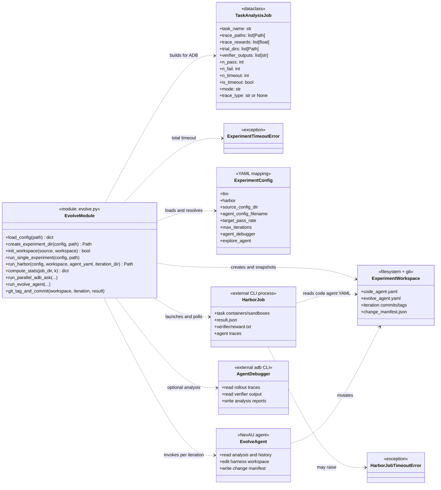
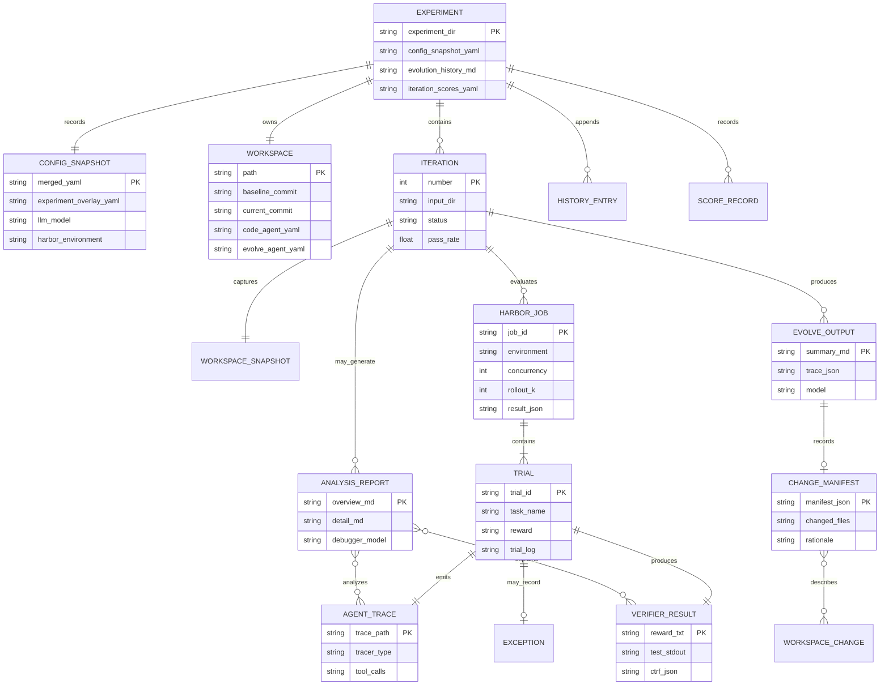
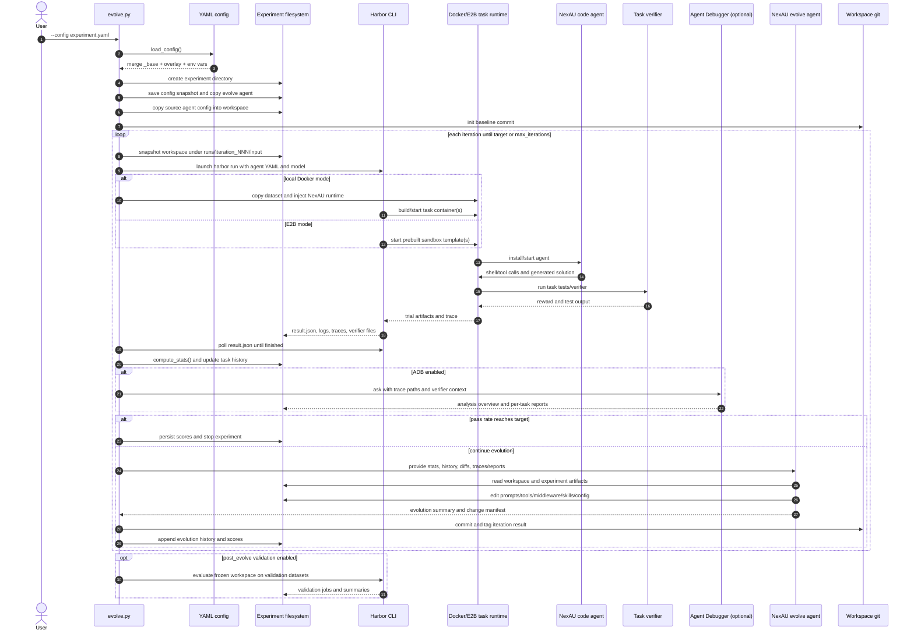

# AHE codebase walkthrough

This document describes the runtime shape of Agentic Harness Engineering (AHE)
as implemented in `evolve.py` and the checked-in agent/config files. AHE is
primarily a procedural orchestration program: most of the application logic is
implemented as functions, while `TaskAnalysisJob` and the timeout exceptions
are the main domain types in the top-level module.

The diagrams use Mermaid. GitHub renders them directly; for other Markdown
viewers, enable Mermaid support.

## 1. Repository map

```text
evolve.py
├── configuration
│   ├── configs/base.yaml
│   └── configs/experiments/*.yaml
├── agents/code_agent_simple/
│   └── code_agent.yaml                  coding agent copied per experiment
├── agents/evolve_agent/
│   └── evolve_agent.yaml                optimizer copied per experiment
├── agents/explore_agent/                optional pre-evaluation exploration
├── scripts/build_templates.py           E2B template preparation
└── experiments/<timestamp>-<name>/
    ├── config_snapshot.yaml
    ├── experiment_overlay.yaml
    ├── workspace/                       mutable harness under evolution
    ├── evolve_agent/                    experiment-local optimizer copy
    ├── evolution_history.md
    ├── iteration_scores.yaml
    └── runs/iteration_NNN/
        ├── input/workspace/             pre-iteration snapshot
        ├── input/benchmark/<job>/       Harbor output
        ├── input/analysis/              optional ADB reports
        └── evolve/                      optimizer output and manifests
```

The important boundary is `experiments/<...>/workspace`. The source agent
configuration is copied there once, then the evolve agent changes that copy.
The original source directory remains the baseline for future experiments.

## 2. Class and module UML

The solid classes below are implemented in this repository. The dashed nodes
are external processes or conceptual interfaces used by AHE; they are shown to
make the runtime boundary explicit, not as claims that these are local Python
classes.



### What is actually instantiated?

- `load_config()` returns nested dictionaries, not a configuration class.
- `TaskAnalysisJob` is created for each task sent to ADB. It gathers trace
  paths, rewards, trial directories, verifier output, and pass/fail/timeout
  counts.
- Harbor and ADB are launched as subprocesses. Their output is represented by
  files and JSON mappings rather than local domain objects.
- NexAU agents are loaded from YAML at runtime. `evolve.py` copies the evolve
  agent into the experiment directory so the run has a stable, auditable
  optimizer configuration.

## 3. Experiment artifact ER diagram

This is an artifact-oriented ER view rather than a database schema. The
relationships are directory and file relationships on disk. A single
`Iteration` normally has one Harbor `Job`, but Best-of-N mode can create one
job per candidate variant and then select a winner.



The main source of truth for pass/fail is the Harbor trial's
`verifier/reward.txt`. `compute_stats()` reads those trial artifacts, groups
trials by task, and derives pass rate, exceptions, and pass@k metrics. ADB and
the evolve agent consume those derived results plus the raw traces; they do not
replace the verifier verdict.

## 4. Overall dataflow and lifecycle



## 5. Lifecycle phases in code

### Startup and configuration

`load_config()` recursively loads `_base`, deep-merges the experiment overlay,
removes the mutually exclusive inherited `path` or `dataset`, and resolves
`${ENV_VAR}` references. `create_experiment_dir()` stores the merged snapshot,
the overlay, and an experiment-local copy of the evolve agent. `init_workspace()`
copies the selected code-agent source directory and creates its baseline Git
commit.

### Evaluation

`run_harbor()` delegates to `launch_harbor()` and `wait_for_harbor()`. The
launcher passes `LLM_API_KEY`, `LLM_BASE_URL`, and `LLM_MODEL` to the Harbor
subprocess, builds the command, and optionally prepares the local Docker task
dataset. Harbor owns the per-task runtime and produces the job directory.

### Measurement and analysis

`compute_stats()` reads every trial's reward and exception artifacts, groups
rollouts by task, and calculates aggregate results. The iteration then updates
task history, stability, score records, and evolution history. If enabled,
`run_parallel_adb_ask()` creates `TaskAnalysisJob` records and invokes `adb ask`
against the relevant traces, adding verifier context for failed rollouts.

### Evolution and persistence

`run_evolve_agent()` loads the experiment-local NexAU configuration, points its
working directory at the experiment, and asks it to improve the harness. The
result is saved as a summary and trace. The mutable workspace is committed and
tagged after each normal evolution iteration, while change manifests are
archived under the iteration's `evolve/` directory.

Best-of-N mode changes only the evolution branch of this lifecycle: it creates
variant workspaces, runs evolve agents concurrently, evaluates variants, picks
a winner, and carries the winner's workspace/results into the next iteration.

## 6. Observability and RSI evidence

The paper's observability claim is concrete in the implementation: AHE keeps
the harness version, the agent's behavior, the external verifier's verdict,
the optimizer's reasoning, and the next evaluation result as separate but
joinable artifacts. This supports an RSI-style loop (recursive self-
improvement) without treating a changed score as sufficient evidence.

The three useful observability layers are:

| Layer | What is observed | Primary artifacts | Optimization question |
|---|---|---|---|
| Component | Which harness files and parameters changed | `workspace/`, Git commits/tags, `change_manifest.json` | What can the optimizer change? |
| Experience | What the coding agent actually did, including tool calls and timing | `agent/nexau_in_memory_tracer.cleaned.json`, `agent/nexau.txt` | Where did behavior diverge or waste effort? |
| Outcome/decision | What the verifier measured and why the evolve agent proposed a change | `reward.txt`, `ctrf.json`, `test-stdout.txt`, ADB reports, `evolve_summary.md`, `evolution_history.md`, score files | Did the predicted fix improve the next evaluation? |

### 6.1 What parameters are being optimized?

The optimization target is the coding-agent harness, not the base model
weights. In the experiment workspace, the evolve agent can change the
following component families:

```text
workspace/
├── systemprompt.md       behavior policy and task strategy
├── code_agent.yaml       tool mode, tool registry, limits, middleware/tracers
├── tool_descriptions/    schemas and descriptions shown to the model
├── tools/                tool implementations and execution semantics
├── middleware/           context, retries, compaction, failover, reminders
├── skills/               reusable procedures and domain guidance
├── sub_agents/           delegated agent definitions
└── LongTermMEMORY.md     durable cross-task knowledge, when present
```

The effective model/provider is deliberately kept separate from these harness
changes. The experiment config selects `llm.model`, API endpoint, and runtime;
the evolution prompt tells the optimizer not to modify the LLM configuration,
tracer, verifier, or infrastructure. That separation makes a pass-rate change
more attributable to harness engineering.

For the current simple code agent, the most immediately relevant knobs are the
system prompt, `run_shell_command`'s YAML description, and its Python binding.
The trace can reveal, for example, whether a shell tool returns enough output,
whether background processes are handled correctly, or whether the prompt
causes the agent to declare success before running a meaningful check.

### 6.2 Example: observing one evaluation

The following is a real shape of `result.json` from a local Docker experiment
(`experiments/2026-09-09__21-46-17__ollama/`), with the UUID shortened here:

```json
{
  "started_at": "2026-09-09T21:46:19...",
  "finished_at": "2026-09-09T21:51:50...",
  "n_total_trials": 1,
  "stats": {
    "n_trials": 1,
    "n_errors": 0,
    "evals": {
      "nexau__local-docker-dataset": {
        "n_trials": 1,
        "n_errors": 0,
        "metrics": [{"mean": 0.0}],
        "reward_stats": {
          "reward": {"0.0": ["headless-terminal__dVjm597"]}
        }
      }
    }
  }
}
```

This says the infrastructure completed normally (`n_errors: 0`), but the task
did not pass (`mean: 0.0`). That distinction is important: infrastructure
health is not agent success.

The verifier is the external ground truth. In the same run:

```text
# verifier/reward.txt
0
```

`verifier/test-stdout.txt` contains the setup and test output, while
`verifier/ctrf.json` (when emitted by the task) contains structured test cases
and failure traces. `compute_stats()` reads `reward.txt`; the analysis path
reads the richer verifier files to explain the score.

### 6.3 Example: observing agent experience

`agent/nexau_in_memory_tracer.cleaned.json` is a structured trace, not just a
text log. A representative excerpt from the same run looks like this:

```json
{
  "name": "Agent: nexau_code_agent",
  "input": {
    "message": "Implement the provided `BaseTerminal` interface..."
  },
  "messages_count": 4,
  "messages": [
    {
      "role": "assistant",
      "tool_calls": [{
        "name": "Tool: run_shell_command",
        "input": {
          "parameters": {
            "command": "mkdir -p /app && ... > /app/headless_terminal.py",
            "is_background": false
          }
        },
        "output": {"result": {"exit_code": 0, "output": ""}}
      ]
    },
    {
      "role": "assistant",
      "content": "The `HeadlessTerminal` class has been implemented..."
    }
  ],
  "total_tokens": 5071,
  "observation_count": 4,
  "generation_count": 2
}
```

This trace exposes optimization opportunities that a score alone cannot:

- The agent made one file-writing tool call and then declared completion.
- The tool returned an empty textual output with exit code 0.
- There is no visible test or import check in the abbreviated interaction.
- The generated implementation used `master.read()` for a live interactive
  terminal, which is a concrete behavior to compare against the verifier.

The trace also records system prompt, tool definitions, model metadata,
latency, and middleware observations where available. `agent/nexau.txt` is the
short human-readable runtime log; the cleaned JSON trace is the better source
for causal analysis.

### 6.4 Example: observing the optimization decision

The evolve agent receives a compact iteration summary that points it back to
the raw trace. A real input excerpt was:

```text
Iteration 1 evaluation completed.
Results path: runs/iteration_001/input/benchmark/2026-09-09__21-46-19/
Pass rate: 0.0% (0/1)
Pass: 0 | Fail: 1 | Exception: 0
headless-terminal — Primary optimization target
Stable fail: 1 — These are the primary optimization targets
For deeper failed task analysis, read the corresponding
agent/nexau_in_memory_tracer.cleaned.json in the trial directory.
```

When ADB is enabled, `TaskAnalysisJob` adds trace paths, rewards, verifier
outputs, timeout labels, and a cross-task overview. The expected outputs are:

```text
runs/iteration_001/input/analysis/overview.md
runs/iteration_001/input/analysis/detail/<task>.md
```

The optimizer should use those digests first, then drill into the raw trace
when a claim needs verification. In the sampled run, `agent_debugger.enabled`
was false, so no ADB reports were generated; the raw trace and verifier output
were still available.

### 6.5 Example: observing optimization outcomes

The sampled run's `evolve_summary.md` recorded the optimizer's outcome as:

```text
The headless-terminal task failure is likely due to the
`run_shell_command` tool not properly handling background processes or
incorrect command execution. ... The system prompt could be refined ...
```

The corresponding `evolution_history.md` joined that decision to the measured
result:

```text
## Iteration 1 — 2026-09-09 21:52
- Pass rate: 0.0% (0/1)
- Failed (1): headless-terminal
- Job directory: `2026-09-09__21-46-19`
```

And `iteration_scores.yaml` persisted machine-readable metrics and timing:

```yaml
scores:
  - iteration: 1
    pass_rate: 0.0
    tasks: {pass: 0, fail: 1, exception: 0, total: 1}
    timing: {eval_min: 6.0, evolve_min: 12.4, total_min: 18.4}
```

The next iteration is the falsification step. It evaluates the evolved
workspace, compares task flips and regressions with the prior result, and can
attribute them through `change_evaluation.json` when a
`change_manifest.json` is present. The sampled one-iteration run did not yet
contain a manifest or a next-generation evaluation, so its proposed fix is a
hypothesis, not evidence of improvement.

### 6.6 Where to look during diagnosis

```text
Question                         First artifact                         Follow-up
-------------------------------  -------------------------------------  ------------------------------
Did Harbor finish?               result.json / trial.log                job.log, exception.txt
Did the task pass?               verifier/reward.txt                     test-stdout.txt, ctrf.json
What did the agent do?           agent/nexau_in_memory_tracer.cleaned.json agent/nexau.txt
Why did it fail?                 analysis/detail/<task>.md                raw trace + verifier output
What should change?              analysis/overview.md / evolve query      evolve_summary.md
What actually changed?           workspace Git diff / change_manifest.json iteration commit/tag
Did it help next time?           iteration_scores.yaml                    evolution_history.md, change_evaluation.json
```

This is the operational meaning of observability-driven RSI in AHE: preserve
the input harness, execution trajectory, verifier outcome, analysis decision,
and resulting harness version so that every proposed improvement can be
challenged by the next evaluation.

## 7. Key implementation references

Line numbers may move as the code evolves; the symbol names are the stable
references.

| Concern | Implementation |
|---|---|
| Config inheritance and env resolution | `load_config`, `deep_merge`, `resolve_env_vars` |
| Experiment creation | `create_experiment_dir`, `init_workspace` |
| Local Docker preparation | `_prepare_local_docker_dataset` |
| Harbor process lifecycle | `_build_harbor_cmd`, `launch_harbor`, `wait_for_harbor`, `run_harbor` |
| Result aggregation | `compute_stats`, `compute_pass_at_k_metrics` |
| Per-task analysis model | `TaskAnalysisJob`, `_run_single_adb_ask`, `run_parallel_adb_ask` |
| Evolution invocation | `run_evolve_agent`, `build_evolution_query` |
| Iteration orchestration | `run_single_experiment` |
| Variant evolution | `run_best_of_n_evolution`, `run_evolve_agent_on_variant` |
| Persistent artifacts | `save_evolve_summary`, `update_history_before`, `update_history_after`, `update_iteration_scores` |
